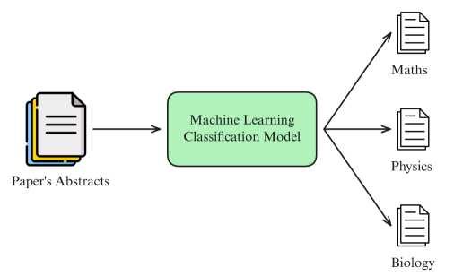

# H1 PROJECT 3.1
[
------------

This Project 3.1 provides the method of how to use the KNN, KMeans and Decision Tree. The purpose of this Project is to help student familiar with the basic function of KNN, KMEANS AND DECITION TREE

## *Project Name*: Newspaper title classification based on KNN, KMeans and Decision Tree

## 1. Introduction
In this project, we will build a Text Classification program that involves classifying an abstract of a publication (scientific article) into different topics.
The program will be built on the Python platform and use popular machine learning libraries such as scikit-learn, numpy, etc.
Accordingly, the general Input/Output of the program will include:
* Input: An abstract of the publication (scientific article).
* Output: Topic of that abstract (e.g. physics, mathematics, computer science, etc.).



## 2. Program Structure
### 2.1 Library Loading

Beside the main library of math, os, sklearn... there are some special libraries below:
* re: regular expression, provide the analysis for text
* sentence_transformers: create and use the model of sentence embedding to sentimental vectors
### 2.2 Data Source

#### 2.2.1 Data Loading Methods
Data source can be loaded by two methods:

**Method 1:**
```python
from datasets import load_dataset`
ds = load_dataset('UniverseTBD/arxiv-abstracts-large')
```
however, this datasets might have some conflicts with version of Python & some library.

**Method 2:**

Load direcly from website. The file with 3.2GB shall be stored in the same folder of main processing notebook and we can access directly by:

#### 2.2.2. Strucure of Dataset
Categories or fields after loading:
* id: The paper's arXiv ID.
* submitter: The person who submitted the paper.
* authors: The list of authors of the paper.
* title: The title of the paper.
* comments: Comments related to the paper.
* journal-ref: Reference to the journal where the paper was published.
* doi: Digital Object Identifier, a unique identifier for the paper.
* report-no: The number of reports related to the paper.
* categories: The topics or fields to which the paper belongs.
* license: The license of the paper.
* `abstract: The summary of the paper (this is the field we will use for classification).`
* versions: The version of the paper.
* update_date: The date the paper was updated.
* authors_parsed: The list of authors that have been parsed and normalized.


### 2.3 User-Defined Function
> > Ngoc Anh update vào đây nếu có function nào viết riêng, nhớ define chức năng của function theo mẫu sau:

```python
def function_name(parameters1=..., parameter2=...): 
    """
    function definition 
    parameter1: .... 
    parameter2: .... 
    return: .....
    """
    <Code>
```
```
Updating....
```
* def preprocessing
* class EmbeddingVectorizer

* `...`
### 2.4 Data Analysis
>> Phần này mô tả dữ liệu, NA có update và phân tích dữ liệu như thế nào thì viết vào đây nhé
* def data_plot: hist, scatter...

### 2.5 Reference
```
Updating....
```

## 3. Incorporate Git-hub function
```
Updating....
```

README is the only file to provide guidelines of this Assignment.

How to run
--------
Run:

```ruby
streamlit.... <In Development>
```

Future Development
----------------

Useful Tools
------------
Pycharm for prorammming
VSCode
Linux Kubuntu v24

Git repository for version control, integrated inside Pycharm
[community]: https://thoughtbot.com/community?utm_source=github
[hire]: https://thoughtbot.com/hire-us?utm_source=github
[ci-image]: https://github.com/thoughtbot/factory_bot/actions/workflows/build.yml/badge.svg?branch=main
[ci]: https://github.com/thoughtbot/factory_bot/actions?query=workflow%3ABuild+branch%3Amain
[grade-image]: https://codeclimate.com/github/thoughtbot/factory_bot/badges/gpa.svg
[grade]: https://codeclimate.com/github/thoughtbot/factory_bot
[version-image]: https://badge.fury.io/rb/factory_bot.svg
[version]: https://badge.fury.io/rb/factory_bot
[hound-badge-image]: https://img.shields.io/badge/Reviewed_by-Hound-8E64B0.svg
[hound]: https://houndci.com

